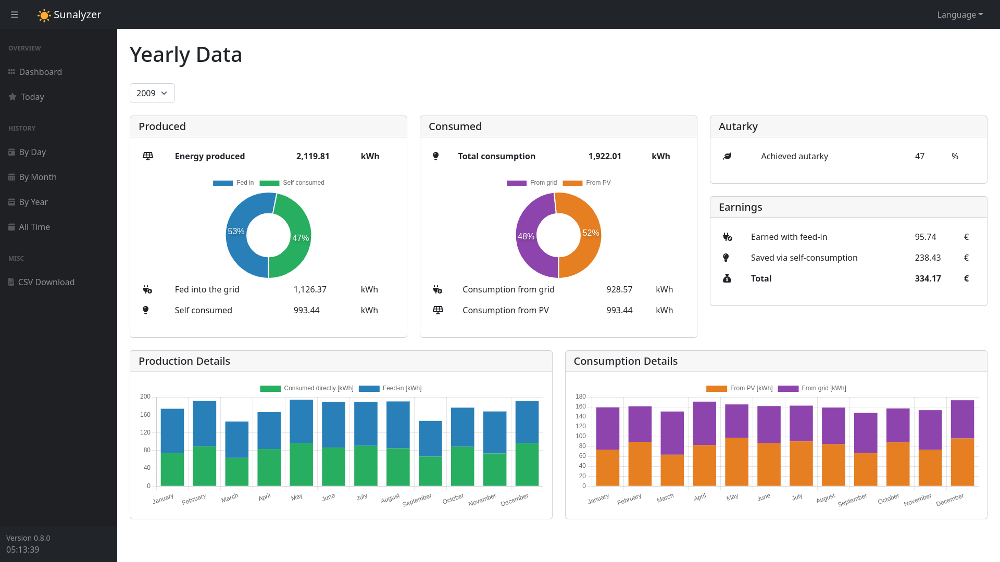

# :sunny: Sunalyzer


Sunalyzer is a free, open source and vendor independent solar monitoring system. It collects relevant data from your inverter/smart meter and stores them safely in a data base.

A modern and beautiful web frontend allows you to visualize the data on any device. The user interface is highly responsive and works great on any screen size, from a small smart phone to a huge PC monitor.

Sunalyzer can easily be self hosted on a Raspberry Pi or a NAS by using Docker. It works 100% offline, no cloud is involved. All your data stays under your control.



## Main Features

- 100% free and open source.
- Easy to set up and configure (e.g. on a Raspberry Pi or a NAS).
- Fully local storage of collected data. No cloud or 3rd party involved.
- Hardware vendor independent.
- Beautiful and highly dynamic user interface. Desktop and mobile friendly.
- Visualization of all important values via graphs.
- Detailled information and statistics with lots of useful information.
- High resolution historical data (1 minute resolution) is kept.
- Very compact database: roughly 15mb of storage are required per year.
- CSV download (manually or via API) of all relevant data.

## Supported Languages

Currently Sunalyzer provides an **English** and a **German** user interface. The language can be changed on the fly via the user interface.

## Supported Devices

Sunalyzer provides integrations for the following device types (inverters/smart meters):
* Fronius (Symo/Gen24)
* Dummy device (for testing purposes)

Contributions for the support of additional devices are welcome. Please feel free to reach out to me or submit a pull request directly.


## Installation instructions

Sunalyzer comes as a self contained and easy to set up Docker container. Thus it can be run on various different platforms. Detailled installation instructions for the Raspberry Pi and Synology DiskStation NAS systems are provided below.

### General Instructions

1. Create a folder called *data* on your host system. This will contain the configuration file and the data base.
2. Create a configuration YAML file in this data folder. Use [this template](templates/config.yml)] as a starting point. A detailled description of the configuration elements can be found below.
3. Pull the latest version of the Sunalyzer Docker image from DockerHub.
4. Create a container based on this image.
  * The container exposes port 5000. Map this to a port on your host system.
  * The container exposes a volume called *data*. Map this to the *data* folder on your host system created in step 1.
5. Make sure your data folder is regularily backed up as it contains the data base!
6. Start the container. Done!

### Using Docker Compose

If you are using Docker Compose, create and run a *docker-compose.yml* file like this:

```yaml
services:
  sunalyzer:
    container_name: sunalyzer
    image: borisbrock/sunalyzer:latest
    restart: always
    ports:
      - "8020:5000"
    volumes:
      - /volume1/docker/sunalyzer/data:/data
```

### Detailled Installation Guide: Synology NAS

If you want to run Sunalyzer on a Synology NAS, [click here](doc/install_synology.md) for detailled installation instructions.

### Detailled Installation Guide: Raspberry Pi

If you want to run Sunalyzer on a Raspberry Pi, [click here](doc/install_raspberrypi.md) for detailled installation instructions.

## Configuration

Sunalyzer is configured via a YAML file called *config.yml*. This file has to be placed in the data folder before the container is started. An example configuration file can be found [here](templates/config.yml)].

### Configuration Settings Overview

| Setting                       | Description                                                                                         |
| ----------------------------- | --------------------------------------------------------------------------------------------------- |
| logging                       | Can be 'normal' (only basic logging) or 'verbose' (verbose logging for debug purposes).             |
| time_zone                     | The time zone that will be used to generate time stamps for logged data. E.g. "Europe/Berlin".      |
| device:type                   | Name of the device plugin to use. Currently "Fronius" and "Dummy" are supported.                    |
| device:start_date             | The date on which the inverter first started production (YYYY-MM-DD).                               |
| prices:price_per_grid_kwh     | Price for 1 kWh consumed from the grid (e.g. in €).                                                 |
| prices:revenue_per_fed_in_kwh | Revenue for 1 fed in kWh (e.g. in €).                                                               |
| server:ip                     | IP address of the web server. Should be set to 0.0.0.0.                                             |
| server:port                   | Port of the web server. Should be set to 5000.                                                      |
| grabber:interval_s            | Interval in seconds that the grabber will use to query the inverter/smart meter. Default is 3s.     |

Additional settings are required depending on the selected device plugin:

#### Fronius

| Setting                       | Description                                                   |
| ----------------------------- | ------------------------------------------------------------- |
| fronius::host_name            | IP address or host name of your fronius inverter.             |
| fronius::has_meter            | True/False - Is there a Fronius smart meter present?          |

## Deveopment Environment

Sunalyzer is currently being developed using the following tools and libraries:
* **Operating system**: Arch Linux
* **Development Environment**: Visual Studio Code
* **Programming languages**: Python 3.12, JavaScript, HTML
* **Database**: SQlite
* **Frameworks**: Bootstrap, Chart.js, hammer.js, Fontawesome
* **DevOps**: flake8, pytest, htmlhint, ESlint
* **Deployment**: Docker
